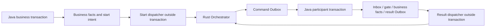

# nasa-saga

[中文](README.md) | [English](README.en.md)

`nasa-saga` connects Java services running on JDK 21 or later to Rust Saga orchestration over HTTP/HMAC or gRPC/mTLS. Participants declare
steps with `@Saga` and atomically commit business facts, Inbox, a participant gate, and result Outbox. Stable identities,
leases, and fencing allow delivery to resume after crashes or uncertain network outcomes. Reliable clients commit
business changes and a start intent together, so a committed business operation does not lose its orchestration request.

HTTP/gRPC components share the nasa-core timing wheel's virtual-thread task executor by default and start the wheel
when needed. Constructor configuration can disable this integration. The host must stop the wheel after all dependent
components finish; its non-daemon scheduling thread keeps the JVM alive after `main` returns.

The Rust Orchestrator owns global state, timers, Definition Catalog, orchestration Inbox/Outbox, and administration.
Java owns its local transactions and evidence for business outcomes. This provides recoverable eventual consistency
and compensation, not cross-service ACID, physical exactly-once delivery, or automatic proof of external effects.

Java does not implement the global `SagaOrchestrator`, `SagaOrchestratorAdmin`, or `SagaDefinitionRegistry` servers.
The two protobuf files retain Rust wire packages, field numbers, RPC names, and enum values; Java generation options
only control local type names.

## Documentation

| Guide | Contents |
| --- | --- |
| [Getting started](docs/getting-started.en.md) | Roles, dependencies, package layout, complete HTTP/gRPC examples, reliable start |
| [Participants](docs/participant.en.md) | Annotations, transaction order, MyBatis, SQL, capability leases, event evidence |
| [Communication execution](docs/execution/README.en.md) | Executor configuration, scope, ownership, and lifecycle |
| [Operations](docs/operations.en.md) | Configuration ownership, monitoring, failures, evidence retention, bounded shutdown |
| [Protocol](docs/protocol.en.md) | Cross-language identities, raw payloads, receipts, compatibility |
| [Publishing to Maven Central](docs/releasing.en.md) | Release configuration, signing, archives, upload, and public availability |
| [Contributing](CONTRIBUTING.en.md) / [Security](SECURITY.en.md) | Development requirements and private vulnerability reporting |
| [License](LICENSE) | Apache-2.0 OR MIT, at your option |

## Architecture and recovery



A client may call Rust directly or persist a start intent with its business writes in the same transaction.
A participant acknowledges only after local COMMIT. Network retries preserve event and command identities;
committed evidence provides deduplication. A worker checks event evidence and its remaining lease before sending,
then settles only with its original owner/token. A stale worker cannot overwrite a later claimant.

New commands and recovery of committed results have separate admission decisions. A host with unavailable business
provenance may keep command, Ready, and capability registration closed while delivering only individually proven
results. An unsupported success is isolated as `NEEDS_ATTENTION`; draining results does not reopen business traffic.
This recovery path requires the Rust coordinator to authorize results independently and recheck authority across transaction
waits; Java retries cannot compensate for a closed result endpoint. See [coordinator requirements](docs/protocol.en.md#coordinator-requirements-for-result-recovery).
Security material changing A→B→A must not restore an old publication generation. This does not cancel a COMMIT already
sent or prevent a privileged external database writer from changing facts outside the protocol.

## Requirements and dependency

Building and running require JDK 21 or later; builds also require Maven 3.6.3+.
`release=21` retains the Java 21 API and bytecode baseline without restricting the build or runtime JDK to version 21.
Maven generates protobuf/gRPC types during the build:

```bash
mvn -B -ntp clean verify
```

```xml
<dependency>
    <groupId>io.github.nasa-runtime</groupId>
    <artifactId>nasa-saga</artifactId>
    <version>1.0.0</version>
</dependency>
```

MyBatis is optional for consumers. Applications using persistence adapters must also declare MyBatis and their JDBC
driver, and own the datasource and transaction lifecycle. The SDK does not automatically open listeners or start scanners.

All public records live in `io.github.nasaruntime.saga.rc`. Annotations, interfaces, transport, and runtime entry points
remain in `io.github.nasaruntime.saga`; MyBatis stores, mappers, SQL providers, and state enums are in `.mybatis`.
Generated types use `.proto.transport.v1` and `.proto.orchestrator.v1`. A root-package wildcard import does not import `.rc`.

## Communication task executor

The transitive dependency `nasa-core:1.0.4` supplies the execution resources.
`rc.SagaExecutionConfig.useTimingWheelExecutor` defaults to `true`; both `new SagaExecutionConfig()` and communication
constructors without execution configuration use this default. Constructing `SagaHttpTransport`,
`SagaGrpcChannels.openMtls`, or `SagaGrpcServers.participantBuilder` calls the default wheel's idempotent `start()`
and borrows `getVirtualExecutor()`. Tasks go directly to that executor without entering wheel slots.
Constructing a server builder does not open a listening port.

Pass `new SagaExecutionConfig(false)` to the configuration overloads to retain the communication libraries' default
executors without initializing or starting the wheel. This setting does not control host HTTP listeners, externally
supplied channels, database transactions, or scanners. Netty retains its I/O threads. Virtual threads do not limit
business concurrency; hosts must still bound active requests and connection use.

Closing a Saga communication component leaves the shared wheel running. Stop admission, finish active work, and close
communication components before stopping the default wheel. Rebuild communication components after restarting the wheel.
See [configuration examples](docs/getting-started.en.md#communication-execution-configuration) and
the [communication component guide](docs/execution/README.en.md), with
[lifecycle requirements](docs/operations.en.md#timing-wheel-executor-lifecycle).

## Roles and authorization

- `SagaControlPlane` provides HTTP/gRPC start, get, query, and audit. `RustSagaClient` also exposes generated gRPC
  administration and Definition Registry calls; Rust remains the authoritative server.
- Ordinary business clients use a separate HTTP credential or certificate principal, restricted to required tenants
  and `start/read/audit`. Workflow publication, administration, and registry access use separate authorization.
- Participants receive commands through `SagaHttpCommandIngress` or `SagaCommandTransportService`, then deliver
  committed results through `SagaHttpResultPublisher` or `SagaTransportClient`.
- Local business writes, Inbox, gate, and result Outbox belong to one Java service transaction. Network delivery runs
  outside that transaction.
- Only matching `Committed` and `Duplicate` receipts advance delivery. Retryable responses, deadlines, disconnects,
  and lost replies preserve the same identity for retry.

The gRPC participant server requires `SagaGrpcServers.participantBuilder`, `SagaMtlsPrincipalInterceptor`, and
`SagaCommandTransportService`. A receipt confirms the participant's local committed facts, not completion of the whole workflow.

## Annotated participant steps

Class-level `@Saga` describes the same step contract as Rust `#[saga]`. Required fields are `workflow`, `step`, and
`version`. Defaults are empty `binding`, `contentType="application/json"`, empty `schemaId`, `compensable=true`,
`allowUnknown=false`, `cancelMode="local-fenceable"`, and `managed=false`. Rust uses the corresponding snake_case names.

`local-fenceable` requires `allowUnknown=false`. `resolve-only` requires `allowUnknown=true` and resolve.
`externally-cancellable` requires `allowUnknown=true`, cancel, and resolve. Every step explicitly declares execute and
compensate, including steps with `compensable=false`. `SagaAnnotationProcessor` validates combinations, method signatures,
generic services, managed constructors, and duplicate steps; `SagaStepDescriptor` validates the contract again at runtime.

`SagaAnnotatedCommandHandler` checks routing, phase, and raw payload, then invokes `SagaParticipantTransaction` for
Inbox → gate → business → result Outbox → COMMIT → ACK. The host implements this transaction with MyBatis.
`SagaStep` returns `SagaOutcome`, `CompensationOutcome`, or `CancelOutcome`; `SagaContext` carries stable command/effect
and target-effect identities. `SagaPayload` preserves raw bytes, media type, and schema without JSON re-encoding.

## Payload and response contracts

Start accepts either JSON `input` or raw `payload`, never both. HTTP encodes `payload.body` as an integer byte array;
gRPC uses protobuf bytes. Reliable start freezes the final request body for every retry.

Protocol DTOs reject duplicate fields, implicit conversions, floating/exponent/string representations of integer fields,
and a root `null` before Java binding. Legitimate optional null fields and independent business JSON null retain their
meaning. Business JSON objects follow Rust's last-value-wins duplicate-key behavior, but overwritten values are still
checked for encoding, numeric, and nesting limits.

JSON accepts only valid UTF-8 without a BOM and valid Unicode scalar values. UTF-16/32, invalid bytes, and unpaired
surrogates are rejected without replacement characters. JSON raw payloads follow the same rules; non-JSON media retain
their bytes under the declared schema. Signing, hashing, and retries use the original bytes.

Business numbers follow Rust's default JSON conversion range: overflow is rejected, while valid large integers, the
largest finite values, underflow to zero, and `0e400` are accepted. Outbound non-finite Java floating values and out-of-range
big numbers cannot become wire data or be silently changed into strings. The string `"Infinity"` is valid business text.
This does not promise identical floating rounding or canonical numeric text between Java and Rust.

Each independent JSON document permits at most 127 nested containers, including its root. Envelope and embedded JSON
input share that limit; a JSON raw body is checked independently after decoding. Outbound envelopes are checked again
after wrapping their payloads. These limits have no configuration override.

`SagaRemoteFailure` classifies direct, reliable-start, and result delivery failures consistently. Authentication,
authorization, missing resources, conflicts/preconditions, and request violations map to HTTP 401, 403, 404, 409, and 422.
gRPC `UNIMPLEMENTED` is deterministic rejection; `FAILED_PRECONDITION` maps to 409 without inspecting free-form messages.
Throttling, timeout, disconnect, server failure, and missing or malformed receipts remain uncertain, exposed as 503.
HTTP 408/425/429/5xx preserve pending delivery with backoff and the frozen identity/body.

Successful HTTP control responses must contain complete typed JSON. Get verifies tenant and Saga identity. Query verifies
tenant, explicit workflow, statuses, creation range, page size, and an explicitly present `sagas` array. Rust filters
creation time in `[created_from_ms, created_to_ms)` at microsecond precision before rounding to milliseconds; Java accepts
a rounded value equal to the upper bound, but an empty range must not contain records. Query snapshots require creation
and update timestamps. Start/get may omit them.

Query/audit results cannot exceed the requested page size, default 100. An empty or null next token means no next page;
whitespace-only tokens are invalid. Nonblank opaque tokens are retained without trimming or re-encoding. Unsupported
states and versions outside the Java `long` range are rejected. Valid instance states are RUNNING, CANCELLING,
WAITING_RESOLUTION, COMPENSATING, COMPLETED, COMPENSATED, MANUAL_INTERVENTION, and MANUALLY_CLOSED; control state is
ACTIVE/PAUSED, and direction is FORWARD/COMPENSATING.

Start receipts require a valid Rust semantic `request_digest` and matching tenant, Saga, workflow, business key,
definition version, and any requested definition digest. Direct mismatches are uncertain/data loss; reliable delivery
isolates a complete but mismatched receipt as `NEEDS_ATTENTION/returned_snapshot_mismatch`. Local raw-body SHA-256
is not Rust's semantic digest.

Audit requires a nonempty ID and kind, a valid time, and object details. Missing record arrays are not empty pages.
Actor, reason, and associated state version may be absent. Protobuf timestamps validate their original seconds/nanoseconds
before conversion; HTTP retains the Rust time text and millisecond projection. See the [protocol guide](docs/protocol.en.md).

## Leases and durable integrity

Claim, network, and settle are separate operations. A lease cannot be extended by a late response or replaced with another
worker's token. The dispatcher reserves the complete request timeout within the remaining monotonic and database lease
budget; evidence lookup also consumes that budget. Expired workers leave durable recovery to a later claim.

Start intents retain original bytes, hashes, and business identity. Corrupted requests are not regenerated from current
objects, and a local body hash does not authenticate arbitrary database rewrites. Local `intent_id` is a canonical lowercase
UUID; recovery may address a malformed persisted key through parameterized SQL and isolate it without normalizing that key.
Remote Saga identity retains its separate opaque contract.

MyBatis stores isolate only definite protocol-contract failures discovered while constructing the claimed record under the
same row lock and live fencing token. They retain original bytes and set `NEEDS_ATTENTION` with
`local_request_contract_invalid` or `local_result_contract_invalid`; claim then returns null and no network authority.
SQL failures roll back instead of being classified as invalid messages. Recovery must not permanently pin unclaimed or
isolated keys in an in-memory wakeup queue.

Result Outbox requires nullable `last_error_code VARCHAR(128)`. Existing tables missing it use
`db/saga-result-outbox-error-code.sql` only after confirming the column is absent; it is not a repeatable migration.
Schema creation does not migrate arbitrary existing data. Custom stores must preserve equivalent lock, fencing, and
original-evidence semantics.

## Participant startup and recovery

HTTP capability receipts explicitly contain all required fields, including a positive `catalog_generation`, and must
match the full route contract and server `route_generation`. Non-JSON, expired, incomplete, or mismatched success responses
remain uncertain and cannot grant command authority. Renewal generations cannot move below the accepted lower bound.

gRPC capability uses an HTTPS origin without an HTTP base path. It checks registration identity, expiry, digest, and route
generation. Current protobuf receipts omit catalog generation; Java projects 0 to mean absent, not authority. Timestamp
seconds must be within `-62135596800..253402300799`, nanoseconds within `0..999999999`, and the resulting lease must still
satisfy absolute and monotonic limits. Invalid receipts are `DATA_LOSS` and do not open admission.

Initialize only role-specific SQL: start intent for reliable clients, participant tables for workers, and replay tables
only for HTTP. These are Java local facts, not Rust global Saga/Catalog tables. HTTP transport applies one timeout across
headers and the complete response, enforces declared and actual body limits, and cancels stalled, oversized, or interrupted
requests as uncertain. Cancelling one request does not close the transport.

Startup verifies control state, each phase effect and full result triple, committed Inbox/immutable Outbox, input bindings,
and matching business provenance. Merely finding a same-value business row is not proof that the current command created it.
The host also checks business facts in the reverse direction for their command origin. A readonly startup snapshot cannot
block other database writers; transaction-time constraints and controlled maintenance remain necessary.

Each phase stores `status`, `terminal_status`, and `reason_code` through `updateGateResult` in the same business transaction.
New attempts replay the recorded decision with current command/event identity, subject to original input matching.
Missing history cannot be invented from current control state. Resolve may advance forward state while the original execute
decision remains UNKNOWN; historical Inbox/Outbox are retained even after delivery.

For result recovery, use the four-argument `SagaResultOutboxDispatcher` with `SagaResultOutboxEvidenceVerifier`. After each
claim and before network I/O, prove the particular event in one consistent readonly snapshot: success needs matching facts
and provenance, compensated success needs compensated facts, and rejection/no-effect barriers need absence evidence.
HALTED and UNKNOWN do not establish success for other events. Missing evidence isolates only that original event as
`local_result_evidence_unavailable`; other events continue independently. Compatibility constructors perform generic
protocol/lease checks only and leave business-proof responsibility to the caller.

Command admission may remain closed while proven results drain. Recovery never changes business facts or old decisions;
Committed/Duplicate only advances delivery state. Draining results does not automatically reopen command, Ready, or capability.

## Input binding and resolution

`SagaParticipantGate.executeInputDigest` and `SagaParticipantInbox.executeInputDigest` map to nullable
`execute_input_digest CHAR(64)`. The host defines the business encoding and conflict policy; effect identity or transport
authentication does not prove equal payloads. Under the gate row lock, `bindExecuteInput` establishes the initial binding
only when no other execute Inbox exists and the gate digest is empty. Binding, Inbox, business facts, and result commit together.
Conflicting input cannot overwrite the effect's decision or historical Outbox, including reuse of the same command ID.

Existing tables missing these columns use the corresponding `saga-participant-input-{mysql,postgresql}.sql` after stopping
writes and confirming both columns are absent. Adding columns does not create historical input evidence. Hosts requiring it
remain closed until trustworthy original commands establish it. Older constructor overloads do not remove the SQL requirement.

Resolve binds `SagaContext.withTargetPhase` to the original execute or compensate effect from the locked gate. A committed
SUCCEEDED/REJECTED forward decision, with no compensation or resolution started, is replayed without calling the business
resolver: uncertain result delivery is not an unknown business effect. Missing-gate resolve creates a durable barrier to late
execute. Resolution terminal outcomes replay; HALTED freezes resolution while preserving UNKNOWN, and only an authorized
recovery operation may reopen it under the original effect conditions.

## Shutdown and limits

Startup failure and normal shutdown use one bounded resource-release path: revoke admission and renewal, stop new
connections and queued work, wait for started local transactions, drain committed results, then close and await HTTP/gRPC
components before closing datasources. Stop the default wheel after all its dependent components finish. Keep dependencies
alive while transactions and results need them. Closing a socket or interrupting a thread does not prove transaction rollback.

All phases share one shutdown budget. Exhaustion records unfinished work and unknown effects while preserving original
identities and Outbox records for restart. External effects still require stable idempotency keys, resolution, or manual
decisions. An already-issued COMMIT remains governed by the database receipt and uncertainty rules. Hosts joining an outer
transaction must enforce authority at its final commit boundary.

## License and feedback

Choose either [Apache License 2.0](LICENSE-APACHE) or [MIT License](LICENSE-MIT), expressed as `Apache-2.0 OR MIT`.
Dependencies retain their own licenses. See [Contributing](CONTRIBUTING.en.md) and [Security](SECURITY.en.md).
Use [GitHub Issues](https://github.com/nasa-runtime/nasa-saga/issues) for ordinary questions and feature requests.
