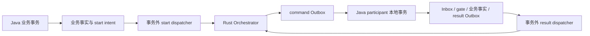

# nasa-saga

[中文](README.md) | [English](README.en.md)

`nasa-saga` 让 Java 21 服务以 HTTP/HMAC 或 gRPC/mTLS 参与 Rust Saga 编排：通过 `@Saga` 声明步骤，
把业务事实与 Inbox、gate、result Outbox 原子提交，并以固定身份、租约和 fencing 在崩溃或网络不确定后恢复投递。
可靠 client 同样把业务写入与 start intent 放入本地事务，避免业务已提交却丢失发起意图。

HTTP/gRPC 通信组件默认共享 nasa-core 时间轮的虚拟线程任务执行器，并在时间轮未启动时自动启动；
可通过构造配置关闭该接入。宿主须在所有依赖组件结束后停止时间轮，其非守护调度线程不会随 `main` 返回而退出。

Rust Orchestrator 保持全局 Saga 状态机、timer、Definition Catalog、Inbox/Outbox 和管理面权威；
Java 负责自己的本地事务与可证明的业务结果。该架构提供可恢复的最终一致性与补偿，不提供跨服务 ACID、
物理 exactly-once 或外部系统效果的自动证明。

Java 侧不提供 Rust Orchestrator 的 `SagaOrchestrator`、`SagaOrchestratorAdmin` 或
`SagaDefinitionRegistry` 服务端实现，也不创建第二套全局 Saga Server。两份 `.proto` 与 Rust
`nasaga-runtime-core/proto` 保持相同的 wire package、字段编号、RPC 名称和 enum 值；Java 侧通过
`java_package`、`java_multiple_files` 和 `java_outer_classname` 控制生成类型的布局，不改变跨语言协议。

## 文档导航

| 文档 | 内容 |
| --- | --- |
| [接入指南](docs/getting-started.md) | 角色选择、依赖、当前包名、完整 HTTP/gRPC client 示例、可靠 start |
| [参与方指南](docs/participant.md) | 注解处理、事务顺序、MyBatis、SQL、capability 与逐事件恢复 |
| [通信执行组件](docs/execution/README.md) | 执行器配置、接入范围、资源归属与生命周期 |
| [运维指南](docs/operations.md) | 配置责任、状态观测、失败处置、保留证据与有界停机 |
| [协议说明](docs/protocol.md) | 跨语言身份、原始正文、收据和类型兼容边界 |
| [贡献指南](CONTRIBUTING.md) / [安全策略](SECURITY.md) | 构建、贡献要求和私密漏洞报告 |
| [许可证](LICENSE) | Apache-2.0 OR MIT，按使用者选择其中一种 |

## 运行架构与恢复



client 可以直接调用 Rust API，也可以选择持久 start intent；后者的业务写入与意图必须同源提交。
participant 的 ACK 必须晚于本地 COMMIT，网络重投保持原 event/command 身份，由持久提交证据去重。
每次领取后复验业务证据与剩余租期，发送后仅凭原 owner/token 结算，失权 worker 不能覆盖新领取者。

新 command 准入与旧 result 恢复分别决策。宿主业务来源不可用时可以保持 command/Ready/capability 关闭，
仅发送逐事件证明成立的原结果；无证据成功进入 `NEEDS_ATTENTION`，结果排空也不自动开放业务。
此恢复路径要求 Rust 协调端提供独立的结果接收资格并在事务等待后持续复验，不能仅靠 Java 重投弥补关闭的结果入口。
安全材料 A→B→A 也不能恢复旧请求的发布代际；部署条件见 [协议说明](docs/protocol.md#结果恢复的协调端条件)。
这不撤销已发送的 COMMIT，也不能防止具有数据库写权限的外部连接绕过协议改写事实。

## 依赖

要求 JDK 21+ 和 Maven 3.6.3+。构建时由 Maven 生成 Java gRPC client/server 类型：

```bash
mvn -B -ntp verify
```

应用通常只需要引入：

```xml
<dependency>
    <groupId>io.github.nasa-runtime</groupId>
    <artifactId>nasa-saga</artifactId>
    <version>1.0.0</version>
</dependency>
```

MyBatis 为可选依赖；使用持久化适配器的应用须显式引入 MyBatis 和 JDBC 驱动，并管理数据源与事务。
SDK 不会自动打开 listener 或启动持久扫描器。

## 通信任务执行器

`nasa-core:1.0.4` 作为传递依赖提供执行资源。`rc.SagaExecutionConfig.useTimingWheelExecutor` 默认 `true`；
`new SagaExecutionConfig()` 与不带执行配置的通信构造方法均使用该默认值。构造 `SagaHttpTransport`、
`SagaGrpcChannels.openMtls` 或 `SagaGrpcServers.participantBuilder` 时，SDK 调用默认时间轮的幂等 `start()`，
随后借用 `getVirtualExecutor()`。任务直接提交给执行器，不经过轮槽；构造 server builder 不会打开监听端口。

向上述入口的配置重载传入 `new SagaExecutionConfig(false)` 可保留通信库默认执行器，且不会初始化或启动时间轮。
该配置不控制宿主 HTTP listener、外部传入的 channel、数据库事务或扫描器；Netty I/O 线程继续由 Netty 管理。
虚拟线程不提供业务并发上限，宿主仍需控制在途请求与连接使用。

关闭 Saga 通信组件不会关闭共享时间轮。宿主应先停止业务入口并完成在途处理、关闭通信组件，
最后停止默认时间轮；独立重启时间轮后需重建通信组件。示例见 [接入指南](docs/getting-started.md#通信执行配置)，
入口与执行范围见 [通信执行组件](docs/execution/README.md)，生命周期边界见
[运维指南](docs/operations.md#时间轮执行器的生命周期)。

## 角色边界

- Java client 通过 `RustSagaClient` 调用 Rust Orchestrator 的 start、get、query、audit，以及经过独立授权的 admin
  和 Definition Registry RPC；这些调用仍只访问 Rust 权威服务端。
- 普通业务 client 使用独立 HTTP credential 或 gRPC certificate principal，仅授予目标租户的
  `start/read/audit`，不配置 workflow grant、`admin` 或 `registry`；管理操作使用单独授权的身份。
- Java participant 通过 `SagaCommandTransportService` 提供 command transport 入站适配，并把本地事务确认后的
  result 通过 `SagaTransportClient` 投递回 Rust Orchestrator。
- Java 本地业务事务、Inbox、participant gate、业务事实和 result Outbox 属于 Java 业务服务自己的资源；
  网络调用不能放进本地数据库事务。
- `Committed` 与 `Duplicate` 才允许投递端前移；`Retryable`、deadline、断连和回包丢失都保留相同身份重投。
- 该架构提供最终一致性和补偿，不提供跨语言跨数据库 ACID 或物理 exactly-once。

gRPC participant 入站端点必须同时安装 `SagaMtlsPrincipalInterceptor` 和 `SagaCommandTransportService`，并使用
`SagaGrpcServers.participantBuilder` 强制双向 TLS。handler 负责把 Inbox、participant gate、业务事实与 result
Outbox 放进同一本地事务；gRPC 收据只表示这组本地事实是否已经提交。

## `@Saga` participant 步骤

Java participant 使用类级别的 `@Saga` 声明 Rust `#[saga]` 的同一组步骤合同，默认值与取消策略一致。
Java 参数为 `workflow`、`step`、`version`（必填）、`binding`（空）、`contentType`（`application/json`）、
`schemaId`（空）、`compensable`（`true`）、`allowUnknown`（`false`）、`cancelMode`（`local-fenceable`）
和 `managed`（`false`）；Rust 合同中对应字段使用 `content_type`、`schema_id`、`allow_unknown`、`cancel_mode`。
完整映射、编译器配置与业务实现责任见 [参与方指南](docs/participant.md)。

`local-fenceable` 要求 `allowUnknown=false`；`resolve-only` 要求 `allowUnknown=true` 并实现 `resolve`；
`externally-cancellable` 要求 `allowUnknown=true` 并实现 `cancel` 和 `resolve`。所有步骤均须显式声明
`execute` 和 `compensate`，`compensable=false` 也不免除方法声明。`SagaAnnotationProcessor` 在编译期
检查这些组合、方法签名、泛型 service、`managed` 无参构造和重复 step；`SagaStepDescriptor` 在运行期再次校验
同一合同。`SagaAnnotatedCommandHandler` 只负责精确 route、phase 和 raw payload 合同校验，随后交给
`SagaParticipantTransaction` 完成 Inbox → gate → 业务 → result Outbox → COMMIT → ACK；该事务实现必须使用
MyBatis，业务网络调用只能由提交后的 result Outbox dispatcher 执行。

全部公开 record 统一位于 `io.github.nasaruntime.saga.rc`；注解、服务接口、transport 与运行入口保留在
`io.github.nasaruntime.saga`，MyBatis store、mapper 和状态枚举位于 `io.github.nasaruntime.saga.mybatis`。

`execute`、`compensate`、`cancel`、`resolve` 的结果状态分别映射到 Rust 的
`SagaOutcome`、`CompensationOutcome` 和 `CancelOutcome`。Java service 可以通过 `SagaPayload` 读取原始正文
字节、`content_type` 和 `schema_id`，因此自定义 schema 不会被 JSON 重新编码破坏；`SagaContext` 的
`effectId`、`commandId`、`targetEffectId` 与 Rust 身份派生规则一致。

Java start 请求同时支持 Rust 的 `input` 和原始 `payload` 入口，但两者必须互斥。HTTP `payload.body` 按
Rust `Vec<u8>` 使用数字数组编码，gRPC 直接使用 protobuf `bytes`；可靠 start 保存最终发送的原始 body，
重试时不会重新解释业务正文。

协议 DTO 在绑定 Java 类型之前检查原始 JSON token：整数不接受浮点、指数或字符串形式，字符串与布尔值
不接受隐式转换，同一协议对象的字段不能重复，嵌套 DTO 也遵守此合同。`raw_payload` 外壳属于协议对象，
其中的 `body` 仍必须是整数数组。业务 `JsonNode` 与原始 body 解码后的 JSON 保持 Rust `serde_json::Value`
语义，业务对象的重复键按后值覆盖；严格协议校验不把这类业务 JSON 误当成协议字段。
协议 DTO 根值 `null` 明确抛出 `SagaProtocolException`，不会返回缺失 envelope；合法可选字段的显式 `null`
以及独立业务 JSON 的 `null` 保持原有语义。

共享 JSON 解码入口只接受无 BOM 的合法 UTF-8，不自动识别 UTF-16/32，不用替代字符掩盖非法字节。
所有字段名和字符串在类型绑定及业务重复键覆盖之前都必须满足 Unicode 标量合同：合法中文、多字节字符、
成对代理项和字面转义原样保留，未配对高位/低位代理项被明确拒绝。外层 envelope 与 `application/json`
原始 payload body 使用相同规则；非 JSON 媒体正文仍按媒体/schema 合同保留原 bytes，不套用 JSON 编码限制。
校验不规范化或重写签名、摘要和重投使用的原始字节。

业务数值在类型绑定和重复键覆盖前按 Rust 默认 JSON 数值转换域校验，溢出数值确定拒绝；大整数不限定为
Java 有符号 `long`，合法最大有限数、下溢为零和 `0e400` 均允许。出站编码也校验内存构造的 DTO、Map 和
JsonNode，非有限 `Double`/`Float`、超域 `BigDecimal`/`BigInteger` 不生成可发送正文，更不能转成字符串。
字符串 `"Infinity"` 本身仍是合法业务字符串。该边界不承诺 Java 与 Rust 的所有浮点舍入或数字 canonical
文本一致，远端发起摘要和冲突裁决仍以 Rust 为准。

每个独立 JSON 正文最多允许 127 层同时嵌套的对象或数组，与 Rust 默认递归预算一致；根容器也计入。
例如 envelope 根对象、业务 payload 对象和其内数组链合计不能超过该限额。`application/json` 原始 body
作为独立 JSON 重新计数，外层的字节数组仍按外层限额检查。出站也应用同一限制，不能把独立正文已通过
校验当作再增加 envelope 包装层后仍可发送的依据。上述限制不增加可放宽协议边界的配置。

## 可靠投递的执行资格与完整性

`SagaRemoteFailure` 为 direct facade、start intent 和 result Outbox 提供相同的远端失败分类。
认证、授权、资源不存在、身份冲突或前置条件不成立、请求合同错误分别映射为业务 HTTP
`401`、`403`、`404`、`409`、`422`；gRPC `UNIMPLEMENTED` 也属于确定的协议拒绝。
gRPC `FAILED_PRECONDITION` 统一映射为 `409`，不按异常描述猜测具体业务原因；HTTP 的 `422` 保留该状态。
限流、超时、断连、服务异常和缺失或损坏的远端收据保留不确定语义，对外为 `503`，不能据此推断远端未提交。
HTTP control 响应的 JSON 解码、必需字段校验和领域收据构造共用 `UNCERTAIN` 边界；query 必须显式提供
`sagas` 数组，空数组表示空页，缺失集合或 null 快照不会作为查询成功。发送前的本地请求校验仍为本地协议错误。
Get 返回前核对 tenant 与 Saga 身份；Query 逐条核对 tenant、显式 workflow、状态集合与创建时间条件，
Rust 创建时间窗口为 `[created_from_ms, created_to_ms)`，查询快照必须包含创建和更新时间，start/get 可省略这两个时间。
Rust 用微秒过滤后四舍五入为毫秒；Java 拒绝低于下界或大于上界的毫秒投影，但允许投影等于上界，亚毫秒过滤
由 Rust 裁决。上下界相同的空区间不得返回记录。
Query/Audit 返回数不得超过请求页大小（缺省 100）。空字符串和 null 下一页 token 统一为 null，纯空白 token
视为损坏响应；非空白 token 原样保留，不裁剪或重编码。范围错配与分页合同错误同样对外为 `503`。
快照状态限定为 `RUNNING`、`CANCELLING`、`WAITING_RESOLUTION`、`COMPENSATING`、`COMPLETED`、
`COMPENSATED`、`MANUAL_INTERVENTION`、`MANUALLY_CLOSED`，控制状态为 `ACTIVE/PAUSED`，方向为
`FORWARD/COMPENSATING`。当前步骤只能为空引用或合法结构化名称；快照与审计的版本字段必须非负，
超过 Java `long` 上界的 protobuf `uint64` 不作为有效版本交付。未知状态须先同步协议合同，不能当作成功事实。
HTTP 与 gRPC start 成功收据均要求 Rust 返回合法 `request_digest`；它是请求语义摘要，与本地 raw body SHA-256 不同。
`SagaControlPlane.start` 在返回 Committed 或 Duplicate 前核对 tenant、Saga、workflow、business key、definition version，
请求指定 `expected_definition_digest` 时还核对 definition digest。错配的 HTTP 响应为 `UNCERTAIN`，gRPC 为 `DATA_LOSS`。
可靠投递的 `SagaStartSender.startRaw` 返回完整远端收据后，由 dispatcher 按冻结 intent 使用相同规则复验；
完整但身份错配的收据进入 `NEEDS_ATTENTION`，记录 `returned_snapshot_mismatch`，不自动采用另一实例。
HTTP `408`、`425`、`429` 和 `5xx` 均可重试；start intent 和 result Outbox 保持 `PENDING`，
按 `next_attempt_at_ms` 退避，并沿用原 Saga/event 身份及冻结正文。

审计记录必须包含非空 `audit_id`、`kind`、发生时间及 JSON 对象明细，允许 actor、reason 和关联状态版本缺省。
HTTP 必须提供 `records` 数组，空数组表示空页；记录保留 Rust 的时间文本和 `occurred_at_ms`。
gRPC 必须提供 `occurred_at` 和 JSON details，Timestamp 秒范围为 `-62135596800..253402300799`，
纳秒范围为 `0..999999999`，转换前拒绝越界值。HTTP 损坏响应归为 `UNCERTAIN`，gRPC 归为 `DATA_LOSS`。
审计身份可能是 `transition:1` 等复合文本；明细内部字段和非空事实类型原样保留，不按 UUID 或固定明细字段集合裁剪。

确定性拒绝使 start intent 和 result Outbox 进入 `NEEDS_ATTENTION`，停止自动领取；人工处置前保留原身份、
正文与业务事实。MyBatis 在原 lease/token 条件下保存 `last_error_code`，例如 `remote_unauthenticated`、
`remote_permission_denied`、`remote_invalid_argument`；异常描述与响应正文不作为原因码保存。
`SagaResultOutboxLeaseStore` 的带 `errorCode` 重载用于原子保存状态与原因；已有自定义实现可继续使用旧签名，
默认重载只回写状态，要保存原因需覆写新签名。

`SagaStartIntentLeaseStore.claim` 和 `SagaResultOutboxLeaseStore.claim` 返回本次领取的不可变记录，
未领取或已持锁隔离非法记录时返回 `null`。适配器必须在更新 lease/token 的同一个短事务内读取快照、提交后返回；
不能先返回成功再独立查询当前 token。`find` 只用于观测，不授予旧 worker 新的执行资格。
MyBatis 适配器将读取保持在领取行锁内，网络调用只发生在事务提交之后。

dispatcher 只用领取快照的 token 回写，且在发送前和收据返回后复验绝对期限及单调预算；
MyBatis 回写 SQL 还按数据库当前时刻拒绝到期 lease，即使尚无其它 worker 重领也不能完成旧动作。
失权回写异常直接传播，不再次尝试改写为待重试。未完成记录保留 `IN_FLIGHT`，由到期恢复流程重领。
远端仍可能已执行，因此重投沿用原身份，不能把本地未完成解释为远端未发生。

start 的完整超时由 `SagaStartSender.requestTimeout()` 提供，HTTP 和 gRPC control plane 均实现该接口。
冻结请求统一保存 Rust HTTP start 形状，gRPC 发送前严格解码并投影到原 protobuf 字段，raw payload 字节不变。
result dispatcher 可显式传入
sender 的超时预算，双参数构造默认五秒；sender 必须强制执行相应超时。lease 必须覆盖网络预算与数据库
提交窗口，实际剩余预算不足时不发新请求。应用和数据库应保持 UTC 时钟同步。

reliable start 在发送前对原始 bytes 计算 SHA-256 并比对冻结的 `request_sha256`，同时核对正文中的租户、
Saga、workflow、业务键、trigger、定义前置条件和 deadline 与本地冻结列。摘要或身份不一致进入
`NEEDS_ATTENTION`，记录低敏 `local_request_digest_mismatch` 或 `local_request_identity_mismatch`，
不调用网络、不自动重试、不覆盖原摘要。完整请求合同不成立时保存 `local_request_contract_invalid`，不把
gRPC 转换错误误认为网络瞬态失败。该校验检测正文与持久化合同的偏差，不防御能同时改写全部事实和
摘要的数据库攻击者；本地摘要也不等同于 Rust `start_request_digest`。

MyBatis start store 若在领取后的记录构造阶段发现空正文等确定的合同错误，会在同一行锁内，以本次
owner、token 和数据库仍未到期的 lease 将其隔离为 `NEEDS_ATTENTION`，保存
`last_error_code=local_request_contract_invalid`，保留原正文、摘要和业务身份。PENDING 与过期 IN_FLIGHT
使用相同规则；隔离成功的 `claim` 返回 `null`，不发起远端请求。不需要删除坏行、生成新 Saga 身份或重算摘要。

本地 `intent_id` 在 `SagaStartIntent` 构造和正常写入前统一要求小写规范 UUID，`ReliableSagaStarter` 自动生成
符合该合同的身份。恢复入口接收数据库中的原始主键，允许参数化 SQL 领取存量异常行，再由记录构造校验
触发上述持锁隔离；非 UUID 主键即使正文合法也不会发送。不会规范化或改写原主键，远端 `saga_id` 仍使用其
独立的 opaque 身份合同。`find` 不提供损坏记录的合法快照；隔离原文应按数据库原始列观测。

MyBatis result store 在领取事务中构造冻结记录；若记录或 envelope 明确违反协议合同，则凭同一行锁与
fencing token 条件隔离为 `NEEDS_ATTENTION`，保存 `last_error_code=local_result_contract_invalid`，
保留原始 bytes，包括不合法的 JSON 根 `null`。此时 `claim` 返回 `null`，不授予网络执行资格。
两种 store 都只隔离明确的 `SagaProtocolException` 因果链；SQL 异常和其它执行失败仍回滚领取，
不能把数据库暂不可用误分类为坏消息。若完成隔离前 lease 已到期，条件回写失败并回滚本次领取。
恢复器不应把未领取或已隔离的主键永久保留在唤醒队列，持久化扫描负责发现以后重新具备执行资格的事件。

result Outbox 的 `last_error_code` 为可空 `VARCHAR(128)`；已有表缺少该列时，应在受控部署窗口执行
`db/saga-result-outbox-error-code.sql`。该脚本适用于 MySQL/PostgreSQL，仅在确认缺列后执行一次；重复执行
会因列已存在而失败，不改写事件正文。自动建表不能代替存量 schema 迁移。自定义 lease store 也应提供
同等的持锁隔离与原文保留语义。

## participant 的启动与租约

HTTP 宿主使用 `SagaHttpCommandIngress`、`SagaHttpCapabilityRegistrar` 和 `SagaHttpResultPublisher`
连接 Rust managed HTTP 数据面。首次 capability 登记完成且收据通过校验后才允许 command 进入本地事务；
`SagaHttpCapabilityRegistrar` 要求收据显式包含全部四项字段，`catalog_generation` 必须为正；同时复验收据租期和
包含服务端 `route_generation` 的完整 capability 摘要。非 JSON、缺失代际、过期或不匹配的成功响应为 `UNCERTAIN`，
不能成为路由权威。宿主续租失败立即关闭 command 准入，续租代际不得低于本进程已经接受的下界。

gRPC 宿主使用 `SagaGrpcCapabilityRegistrar`、`SagaCommandTransportService`、`SagaTransportClient`，并通过
`SagaGrpcServers`、`SagaGrpcChannels` 与 `SagaMtlsPrincipalInterceptor` 装配双向 TLS 和叶证书 principal。
`SagaMtlsMaterial` 支持与 Rust 相同字段的 JSON 凭据材料；不得把私钥放入 descriptor 或日志。
gRPC capability 只声明 HTTPS origin，不带 HTTP base path；收据核对 registration ID、期限、摘要和 route generation。
Rust 当前 protobuf receipt 不携带 catalog generation，Java 投影为 0 表示未提供，不生成虚假的 Catalog 权威。
`accepted_until` 必须存在，秒范围为 `-62135596800..253402300799`、纳秒范围为 `0..999999999`；先验证原始值再
转换为毫秒，合法时间还必须满足未过期租约和本地单调预算。损坏收据为 `DATA_LOSS`，不得开放或延续 command 准入。
两套 protobuf 的 wire 合同以 Rust `nasaga-runtime-core/proto` 为准；Java 文件只增加 Java 生成选项。

按角色初始化可使用 `db/saga-start-intent-{mysql,postgresql}.sql`、`db/saga-participant-{mysql,postgresql}.sql`
和仅 HTTP 需要的 `db/saga-http-replay-{mysql,postgresql}.sql`，避免为 client 创建 participant 表或为 gRPC
创建 replay 表。这些表只保存 Java 本地事务事实，不创建 Rust 全局 Saga 状态或 Catalog。

`SagaHttpTransport` 从请求开始使用同一单调超时预算等待头部和完整正文；首字节到达不会重置预算。
声明大小和实际接收字节数都受响应上限约束。正文停滞、超限或调用线程中断会主动取消该请求，按
`UNCERTAIN` 保留原业务身份处理；取消单次请求不会关闭整个 transport。

宿主必须把服务端绝对租期与从请求发起时计算的单调预算取较早期限，并在每次 command 准入时复验。
续租失败、到期或停机立即拒绝新动作；阻塞的续租请求和迟到响应不能延长或恢复已经关闭的宿主。
Ready 检查不能替代 command 的本地准入门禁，运行机器仍应保持时钟同步。

初始化失败与正常停机应使用同一有界资源释放路径：先撤销准入与续租、关闭新连接并取消尚未执行的队列任务，
再等待已经开始的本地事务提交或回滚、排空已提交 result，关闭并等待 HTTP/gRPC 通信组件结束后关闭数据源。
默认时间轮的全部依赖组件结束后再停止时间轮。等待事务和结果期间必须保留它们依赖的资源，不能用 socket
关闭或线程中断推断事务已经结束。
`SagaHttpTransport.close()` 取消未完成请求，不等待远端结束响应，因此只能在排空完成或进入明确强制收口后调用。
所有阶段应共享一个停机预算；预算耗尽必须记录未完成阶段与未知效果，保留原 command/effect/event 身份供重启
恢复，不能删除 Outbox 或把未知记为成功。外部效果仍需稳定幂等键或 resolution，停机排空不提供跨系统原子性。

## participant 的裁决与输入绑定

`SagaParticipantGate` 分别保存 execute、cancel、compensate、resolve 的完整 `status`、`terminal_status` 与
`reason_code`，对应 SQL 列为 `<phase>_result_status`、`<phase>_result_terminal_status`、`<phase>_result_reason_code`。
宿主须在受锁 gate 的同一事务内调用 `updateGateResult`，与业务事实、Inbox 和 result Outbox 一起提交。
新 attempt 重放阶段裁决时只生成新的 command/event 身份，不从控制状态推测原因；需要业务输入的效果还须先核对首次输入绑定。
尚无裁决的三列为空；存量控制状态不能代替结果证据，缺失时宿主应保持关闭，停写核对原 Inbox 与 Outbox 后迁移。
无法唯一还原的记录须人工裁决，不得填入具体业务原因或自动重执行业务。
宿主还须在开放路由前核对控制状态、阶段 effect、完整结果与原 COMMITTED Inbox/不可变 Outbox 的一致性，
并以同身份业务事实证明成功；仅检查三元组格式不足以建立重放权威。原 execute UNKNOWN 经 resolve 得到终态时，
允许正向控制状态推进，原 execute 裁决仍保持不变。原始 Inbox/Outbox 属于重启证据，不能仅因结果已投递而删除。
宿主还须反向核对每条业务事实的命令来源，不能只遍历已有 gate。首次准入遇到既存同值事实时，身份和状态一致并不
证明它由当前本地事务产生；应冻结或关闭，不能用新的 Inbox/Outbox 追认成功。只读启动快照不能封锁其它连接的后续写入，
事务内的唯一竞争与来源核对仍须覆盖首次 execute；人工迁移须停写并使用可信原始证据。
command 准入与逐事件 result 恢复资格须分开：业务来源不可用时继续关闭 listener、Ready 和 capability。结果结构、
固定身份、Inbox/gate 提交证据、原 payload、出站凭据与 lease/fencing 成立之后，仍须证明该事件承诺的业务语义。
`SagaResultOutboxDispatcher` 的四参数构造器接收 `SagaResultOutboxEvidenceVerifier`，在每次领取后、网络之前核验；
返回 false 将单个原事件隔离为 NEEDS_ATTENTION，记录 `local_result_evidence_unavailable`，其它事件独立继续。
检查应使用同一只读一致快照：成功需要匹配的业务事实，补偿成功需要已补偿事实，拒绝或无效果屏障需要不存在证明；
HALTED 冻结和 UNKNOWN 未决不能替其它成功事件作证。没有 verifier 的兼容构造器只执行通用协议与租约检查，
调用方仍须自行提供业务证据边界。证据读取耗时也计入 lease，发送前重新检查完整网络预算。
恢复不得改写业务事实或原裁决，Committed/Duplicate 只前移发送状态；结果排空不能自动恢复业务准入。

gate 和 Inbox 均提供可空 `execute_input_digest CHAR(64)`，分别对应 `SagaParticipantGate.executeInputDigest`
与 `SagaParticipantInbox.executeInputDigest`。前者冻结首次准入的业务输入，后者记录当前 execute 命令的输入。
编码及业务冲突语义由宿主定义；SDK 不把 effect ID 或传输认证当作 payload 相同的证明，也不自动生成通用原始正文摘要。
`bindExecuteInput` 要求调用方持有 gate 行锁，仅在尚无其它 execute Inbox 且原摘要为空时建立绑定；绑定、Inbox、业务
事实与 Outbox 必须同事务提交。重放前须比较输入，命令级冲突事件不能覆盖原效果的 gate 裁决或历史 Outbox。
同 command 的不同输入也不能获得 Duplicate；必须保留原证据并拒绝。宿主的启动校验须区分原输入事件与冲突输入事件，
并用首次绑定复验成功业务事实，不能从当前事实反推首次命令。无需输入的效果可以保持摘要为空，但须明确业务边界。

存量表缺少摘要列时，可在停写、备份并确认两表均缺列后执行 `db/saga-participant-input-mysql.sql` 或
`db/saga-participant-input-postgresql.sql`。这两个脚本只增加列，不提供存量输入证据；需要输入绑定的宿主须依据可信原始
命令核对并补齐，无法证明时保持关闭。MyBatis 的读写依赖这些列，旧构造参数重载仅保留 Java 调用兼容性。

## participant 的 resolve 合同

事务 wrapper 从受锁 gate 决定 resolve 的原目标，再用 `SagaContext.withTargetPhase` 传给业务 resolver，
不能把 resolve 自身的 `effectId` 当作原支付效果。既有 resolution 终态对新 attempt 重放原裁决，并为当前
command 创建对应 result Outbox；`HALTED` 只冻结查询，保留原 `UNKNOWN`，受信 recovery operation 才能重新查询。

正向 gate 已为 `SUCCEEDED/REJECTED`、补偿尚未开始且 resolution 为 `NONE` 时，result 回传未知不代表
业务效果未知。Java 与 Rust MySQL/PostgreSQL participant 在同一事务中登记 resolution 终态与 resolve 身份，
重放确定事实而不调用业务 resolver。缺少原 gate 的 resolve 必须持久冻结后到 execute，不能凭空查询。

## 协议来源

`src/main/proto/saga_transport.proto` 和 `src/main/proto/saga_orchestrator.proto` 是 Java 侧生成入口，内容
必须与 Rust `nasaga-runtime-core/proto` 同步。协议变更应先更新 Rust 的公开 proto，再同步 Java 镜像并执行
跨语言合同校验。

## 许可证与反馈

采用 [Apache License 2.0](LICENSE-APACHE) 或 [MIT License](LICENSE-MIT)，由使用者选择其中一种。
SPDX 表达式为 `Apache-2.0 OR MIT`。依赖项保持各自许可证。
贡献方式见 [CONTRIBUTING.md](CONTRIBUTING.md)，安全问题按 [SECURITY.md](SECURITY.md) 私下报告；
普通问题与功能建议通过 [GitHub Issues](https://github.com/nasa-runtime/nasa-saga/issues) 反馈。
