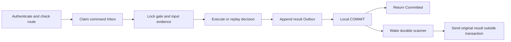

# Participant integration and local transactions

[中文](participant.md) | [English](participant.en.md)

`@Saga` declares a step. `SagaAnnotatedCommandHandler` checks route, phase, and payload; the application implements
`SagaParticipantTransaction` with MyBatis so business facts, Inbox, gate, and result Outbox share one transaction.
Annotations do not automatically create a database, listener, renewal thread, or global Orchestrator.

## Step declarations

| Java annotation field | Contract | Default and requirement |
| --- | --- | --- |
| `workflow`, `step`, `version` | Workflow, step, definition version | Required; match Rust's frozen definition |
| `binding` | Named transaction domain | Empty; multi-datasource hosts bind it explicitly |
| `contentType`, `schemaId` | `content_type`, `schema_id` | `application/json`, empty string |
| `compensable` | Compensation support | `true` |
| `allowUnknown` | UNKNOWN support | `false` |
| `cancelMode` | Cancellation policy | `local-fenceable` |
| `managed` | Host construction through a no-argument constructor | `false`; true requires an accessible constructor |

`local-fenceable` requires `allowUnknown=false` and uses a durable cancellation barrier. Both `resolve-only` and
`externally-cancellable` require `allowUnknown=true` and an explicitly declared `resolve` implementation; the latter also
requires a real, explicitly declared `cancel`. Disabling compensation does not turn an unknown effect into failure.
Unknown business effects and uncertain result delivery are different states.

`SagaStep` methods receive `rc.SagaContext` and `rc.SagaPayload`, returning the corresponding outcome record in a
CompletionStage. Exceptions mean no committable conclusion was produced and must not receive a success ACK. Use the host's
bound transaction/session; do not move JDBC work onto threads that lose that binding or wait for result networking inside it.

Every concrete step class must explicitly declare public `execute` and `compensate` methods, even with `compensable=false`.
That flag rejects compensate command admission; it does not remove the interface method. Declare the exact return type
`CompletionStage<SagaOutcome>` for execute/resolve, `CompletionStage<CompensationOutcome>` for compensate, or
`CompletionStage<CancelOutcome>` for cancel. Raw types, wildcard type arguments, and `CompletableFuture` return types do not
satisfy the contract. Inherited methods do not satisfy explicit declaration. Do not apply annotations whose simple name is
`Transactional` or `transactional` to the service or its methods; `SagaParticipantTransaction` owns the transaction boundary.

The processor is registered through a service file. An application may configure Maven explicitly:

```xml
<plugin>
    <groupId>org.apache.maven.plugins</groupId>
    <artifactId>maven-compiler-plugin</artifactId>
    <version>3.14.1</version>
    <configuration>
        <release>21</release>
        <annotationProcessorPaths>
            <path>
                <groupId>io.github.nasa-runtime</groupId>
                <artifactId>nasa-saga</artifactId>
                <version>1.0.0</version>
            </path>
        </annotationProcessorPaths>
    </configuration>
</plugin>
```

The example's `release=21` sets the application artifact's compatibility baseline and permits compilation on a newer JDK.
Applications needing newer language features or APIs may select a release matching their deployment JDK. The processor
supports the source levels provided by the compiler running it, without a fixed limit of 21.

Compilation checks declarations, signatures, duplicate steps, and construction requirements. `rc.SagaStepDescriptor`
checks runtime contracts. Neither proves idempotency, valid compensation, or business provenance; transactions and durable
constraints must provide those properties.

## Transaction order



- Check identity, definition digest, owner, and payload before business execution. Deduplication is not authentication.
- Recheck phase admission under the gate row lock. Bind the initial execute input when the effect depends on it; conflicting
  input cannot replay success.
- Commit business and control facts together, or roll back together. Never acknowledge before commit or persist only Inbox.
- Duplicate requires complete committed evidence for the same command. A unique-key conflict alone does not prove provenance.
- `effect_id` identifies the stable effect; `command_id` identifies an action attempt and stays fixed across network retries;
  `event_id` identifies its result.
- After-commit wakeup lowers latency; database scanning, rather than an in-memory queue alone, provides crash recovery.

Resolve queries the target execute/compensate effect, not its own new effect ID. Persist cancellation and missing-effect
barriers so a late execute cannot bypass the recorded decision.

## Database initialization and migration

Load role-specific SQL from classpath `db/`; sources are in [src/main/resources/db](https://github.com/nasa-runtime/nasa-saga/tree/master/src/main/resources/db).

| Role or operation | MySQL | PostgreSQL |
| --- | --- | --- |
| Reliable client | `saga-start-intent-mysql.sql` | `saga-start-intent-postgresql.sql` |
| Participant gate, Inbox, result Outbox | `saga-participant-mysql.sql` | `saga-participant-postgresql.sql` |
| Durable HTTP replay | `saga-http-replay-mysql.sql` | `saga-http-replay-postgresql.sql` |
| Add input binding to existing gate/Inbox | `saga-participant-input-mysql.sql` | `saga-participant-input-postgresql.sql` |
| Add result Outbox error code | `saga-result-outbox-error-code.sql` | Same script |

`saga-mysql.sql` and `saga-postgresql.sql` contain the full local table set. Role-specific deployments need not create
unrelated tables. None of these resources creates Rust global Saga/Catalog. Business tables belong to the host and must
support atomic transactions in the same domain.

Run column additions only after stopping writes, backing up, and confirming the columns are absent. They do not reconstruct
historical inputs, decisions, or business evidence. Missing provenance keeps business admission closed for manual inspection;
fabricated successful backfills are not valid migration. Initialization is not arbitrary existing-data migration.

## Transport and capability

HTTP hosts bind `SagaHttpCommandIngress` with `SagaHttpMessageAuthenticator` and durable
`SagaMybatisHttpReplayClaimStore`. Supply the actual listener path, raw body, and authentication headers. Register capability
through `SagaHttpCapabilityRegistrar` and send results through `SagaHttpResultPublisher`.

`SagaGrpcServers.participantBuilder` starts the nasa-core default wheel as needed and borrows its virtual-thread executor
for service callbacks. Both port and address overloads accept
`new io.github.nasaruntime.saga.rc.SagaExecutionConfig(false)` to retain gRPC defaults. Constructing the builder does not
start a listener; host HTTP listeners keep their own executors. Outbound HTTP/gRPC components use the same configuration
contract. Closing one component does not close the shared wheel. See the [communication component guide](execution/README.en.md)
for execution scope and [lifecycle requirements](operations.en.md#timing-wheel-executor-lifecycle) for coordinated shutdown.

gRPC hosts use `SagaGrpcServers.participantBuilder`, `SagaMtlsPrincipalInterceptor`, and `SagaCommandTransportService`.
Derive a trusted producer from its certificate principal, register through `SagaGrpcCapabilityRegistrar`, and publish through
`SagaTransportClient`. HTTP replay tables are unnecessary; finite RPC deadlines are required.
For gRPC capability, `requestedLeaseMs` must be a positive multiple of 1000, with the converted seconds fitting uint32.

Before admission, verify schema, committed history, business provenance, input bindings, outbound credentials, and lease
fields. A bound listener stays protected until a valid capability receipt and local evidence allow commands. Use the earlier
of server absolute expiry and the monotonic budget measured from request start. Renewal failure, expiry, and shutdown close
admission immediately; late receipts cannot extend lost authority.

## Recovering committed results separately

When business provenance is unavailable, a host may recover result Outbox if minimum committed-result evidence remains valid.
This is a host assembly policy: the SDK does not automatically switch modes or listeners. Recovery-only operation registers
no capability, opens no command/Ready listener, and executes no business handler.

Supply `SagaResultOutboxEvidenceVerifier` through the dispatcher's four-argument constructor. After each claim and before
network I/O, use a consistent readonly snapshot to prove this event's promise. Success needs matching facts and provenance;
compensation needs compensated facts; rejection and no-effect barriers need absence evidence. HALTED/UNKNOWN do not prove
success and cannot validate another event.

Missing evidence isolates only that event as `NEEDS_ATTENTION/local_result_evidence_unavailable`, preserving payload and facts.
Other events continue independently. Evidence lookup consumes lease time, and remaining network budget is checked again.
Compatibility constructors do not provide business proof; callers must supply an equivalent boundary.

Rust's managed Orchestrator may independently authorize results when command routes are unavailable, but Catalog, frozen
definitions, owner trust, lifecycle, and evidence expiry must still hold. Result acceptance does not reopen Start, ordinary
queries, or timers. An A→B→A security publication cannot revive an old in-flight permit. Draining results does not restore
business provenance; full admission checks are required before reopening. See [Operations](operations.en.md).
