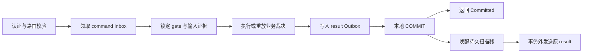

# 参与方接入与本地事务

[中文](participant.md) | [English](participant.en.md)

`@Saga` 声明步骤合同，`SagaAnnotatedCommandHandler` 负责 route、phase 与 payload 检查；应用实现
`SagaParticipantTransaction`，使用 MyBatis 将实际业务事实、Inbox、gate 与 result Outbox 放在同一个事务。
SDK 不从注解自动创建业务数据库、listener、续租线程或全局 Orchestrator。

## 步骤声明

| Java 注解参数 | 对应合同 | 默认值与约束 |
| --- | --- | --- |
| `workflow`、`step`、`version` | workflow、步骤与定义版本 | 必填，须与 Rust 冻结定义一致 |
| `binding` | 命名事务域 | 空值；多数据源宿主必须明确绑定 |
| `contentType`、`schemaId` | `content_type`、`schema_id` | `application/json`、空字符串 |
| `compensable` | 是否允许补偿 | `true` |
| `allowUnknown` | 是否允许 UNKNOWN | `false` |
| `cancelMode` | 取消策略 | `local-fenceable` |
| `managed` | 由宿主按无参构造装配 | `false`；为 true 时要求可用无参构造 |

`local-fenceable` 要求 `allowUnknown=false`，由持久 gate 建立取消屏障。`resolve-only` 与
`externally-cancellable` 均要求 `allowUnknown=true` 并显式实现 `resolve`；后者还必须显式实现真实 `cancel`。
`compensable=false` 不会把未知效果变成失败，仍需按声明策略处理。业务结果与“结果网络回传未知”必须分别建模。

`SagaStep.execute/compensate/cancel/resolve` 接收 `rc.SagaContext`、`rc.SagaPayload`，返回对应 record 的
`CompletionStage`。异常表示当前处理没有可提交结论，不能 ACK 成功。业务实现应通过注入的事务上下文使用
当前 session；不要把 JDBC 工作任意转移到丢失事务绑定的线程，也不要在事务内等待 result 网络投递。

所有步骤都必须在当前具体类中显式声明 public `execute` 与 `compensate`，包括 `compensable=false` 的步骤；
该标记禁止 compensate 命令准入，不免除接口方法。返回类型必须声明为精确的 `CompletionStage<SagaOutcome>`
（execute/resolve）、`CompletionStage<CompensationOutcome>`（compensate）或 `CompletionStage<CancelOutcome>`
（cancel），不能用 raw type、通配泛型或 `CompletableFuture` 返回类型替代。继承的方法不满足显式声明要求。
service 与方法不能叠加简单名为 `Transactional` 或 `transactional` 的注解；事务边界由 `SagaParticipantTransaction` 持有。

编译期处理器通过 service 文件注册。应用可显式配置 Maven：

```xml
<plugin>
    <groupId>org.apache.maven.plugins</groupId>
    <artifactId>maven-compiler-plugin</artifactId>
    <version>3.14.1</version>
    <configuration>
        <release>21</release>
        <annotationProcessorPaths>
            <path>
                <groupId>io.github.nasa-runtime</groupId>
                <artifactId>nasa-saga</artifactId>
                <version>1.0.0</version>
            </path>
        </annotationProcessorPaths>
    </configuration>
</plugin>
```

处理器校验声明、方法签名、重复步骤及构造条件；`rc.SagaStepDescriptor` 在运行期继续校验。编译通过不证明
业务实现具备幂等性、补偿正确性或可信业务来源，后者必须由事务与持久约束提供。

## 事务顺序



- 身份、定义摘要、owner 和 payload 合同在进入业务前核对；持久去重不能替代认证。
- 取得 gate 行锁后复验阶段准入。需要业务输入的效果绑定首次 execute input digest，冲突输入不能重放成功。
- 业务事实和所有控制事实必须同事务提交；失败时整笔回滚，不能只提交 Inbox 或先返回成功。
- `Duplicate` 必须有同一 command 的完整已提交证据。唯一键冲突本身不证明该业务效果来自当前命令。
- `effect_id` 标识稳定业务效果；`command_id` 标识动作 attempt，网络重投保持不变；`event_id` 标识对应结果。
- after-commit 唤醒仅降低延迟；重启恢复依靠数据库扫描，不能只依赖内存队列。

resolve 查询原 execute 或 compensate 的目标 effect，不能使用 resolve 自身的新 effect 作为业务查询键。
取消和补偿的缺失效果屏障必须持久化，防止后到 execute 绕过已提交裁决。

## 数据库与迁移

从 classpath 的 `db/` 读取与角色匹配的 SQL。资源也位于仓库的
[src/main/resources/db](https://github.com/nasa-runtime/nasa-saga/tree/master/src/main/resources/db)：

| 场景 | MySQL | PostgreSQL |
| --- | --- | --- |
| 可靠 client | `saga-start-intent-mysql.sql` | `saga-start-intent-postgresql.sql` |
| participant gate、Inbox、result Outbox | `saga-participant-mysql.sql` | `saga-participant-postgresql.sql` |
| HTTP 持久 replay | `saga-http-replay-mysql.sql` | `saga-http-replay-postgresql.sql` |
| 已有 gate/Inbox 增加输入绑定列 | `saga-participant-input-mysql.sql` | `saga-participant-input-postgresql.sql` |
| 已有 result Outbox 增加错误码列 | `saga-result-outbox-error-code.sql` | 同一脚本 |

`saga-mysql.sql`、`saga-postgresql.sql` 为完整本地表集合。按角色部署时不要依赖全量脚本创建无关表。
这些资源都不创建 Rust 全局 Saga/Catalog。业务表由应用拥有，必须使用支持同源原子事务的结构和引擎。

增列脚本仅在停写、备份并核对目标缺列后执行；它们不会构造历史输入、裁决或业务证据。存量来源缺失时保持业务
关闭并人工核对，不能用自动回填的“成功”掩盖未知。对已有数据运行脚本前须按其前置条件核对，不能把初始化当作迁移。

## HTTP 与 gRPC 装配

`SagaGrpcServers.participantBuilder` 默认按需启动 nasa-core 默认时间轮，并借用其虚拟线程执行器执行服务回调。
端口和监听地址重载均可传入 `new io.github.nasaruntime.saga.rc.SagaExecutionConfig(false)` 以保留 gRPC 默认值。
构造 builder 不启动 listener；宿主提供的 HTTP listener 继续使用自己的执行器。HTTP/gRPC 出站组件采用同一配置合同，
关闭任一组件不关闭共享时间轮；完整执行范围见 [通信执行组件](execution/README.md)，
统一停机要求见 [运维指南](operations.md#时间轮执行器的生命周期)。

HTTP 宿主绑定 `SagaHttpCommandIngress`，使用 `SagaHttpMessageAuthenticator` 和持久
`SagaMybatisHttpReplayClaimStore`；把 listener 实际收到的 path、原 body 与认证头交给 ingress。
capability 通过 `SagaHttpCapabilityRegistrar` 登记，结果通过 `SagaHttpResultPublisher` 发送。

gRPC 宿主使用 `SagaGrpcServers.participantBuilder`、`SagaMtlsPrincipalInterceptor` 和
`SagaCommandTransportService`，用证书 principal 得到受信 producer。`SagaGrpcCapabilityRegistrar` 登记步骤，
`SagaTransportClient` 发送原结果。此路径无需 HTTP replay 表，必须设置有限 deadline。
gRPC capability 的 `requestedLeaseMs` 必须为正整数秒对应的毫秒值，即 1000 的整数倍，换算后的秒数不能超过 uint32 上界。

启动时先核对 schema、提交历史、业务来源、输入绑定、出站凭据和租约字段。listener 即使已绑定也保持保护态，
只有有效 capability 收据且本地证据成立才准入 command。服务端绝对期限与从请求发起计算的单调预算取较早值；
续租失败、到期或停机立即关闭准入，迟到收据不能延长已经失去的执行权。

## 单独恢复已提交结果

业务来源不可用时，宿主可在最小结果提交证据成立的前提下仅恢复 result Outbox；这是一种宿主装配方式，
SDK 不会自动启停 listener 或切换模式。恢复态不注册 capability、不开放 command/Ready、不执行业务 handler。

使用 `SagaResultOutboxDispatcher` 四参数构造器提供 `SagaResultOutboxEvidenceVerifier`，在每次领取后、发送前，
从一致快照核对当前事件语义：成功需同身份业务事实与可信来源，补偿需已补偿事实，拒绝或无效果屏障需不存在证明。
HALTED/UNKNOWN 自身不承诺成功，不得用它们替其它事件作证。

缺少语义证据时，仅隔离该原事件为 `NEEDS_ATTENTION/local_result_evidence_unavailable`，保留正文与所有业务事实；
其它事件继续独立裁决。读取证据消耗的时间计入 lease，网络前还须复验剩余预算。兼容构造器不提供业务证据证明，
应用必须自行承担相同边界。

Rust 受管 Orchestrator 可在 command 路由不可用时独立核对结果资格。其 Catalog、冻结定义、信任材料、生命周期和
证据期限仍必须成立；结果接收不会开放新 Start、普通查询或 timer。安全快照 A→B→A 不能让旧在途资格恢复。
结果排空也不表示业务来源已经恢复；重新开放须经过完整业务准入校验。运行处置见 [运维指南](operations.md)。
